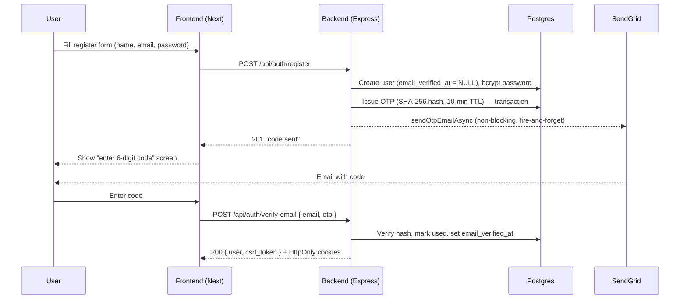
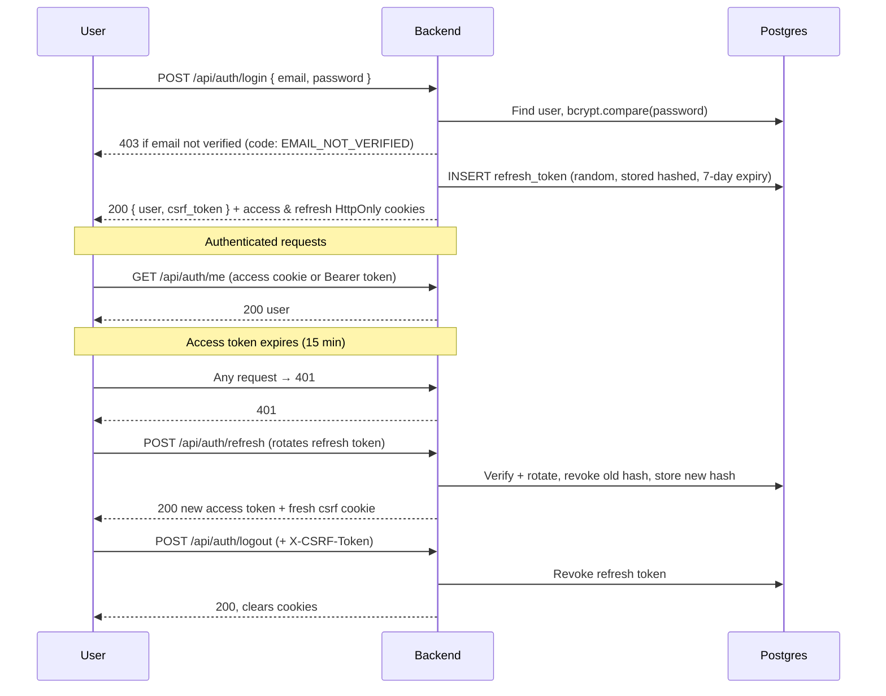
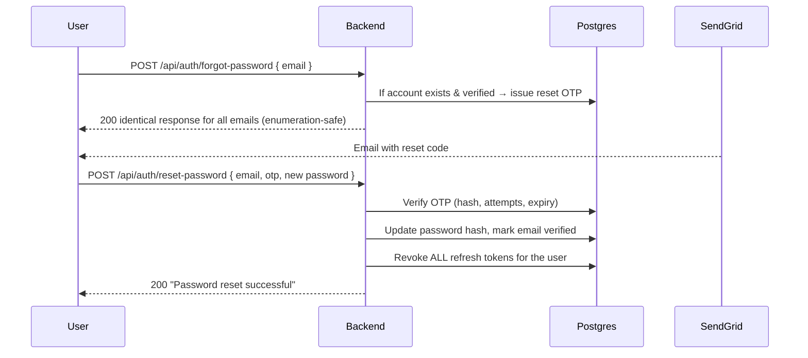
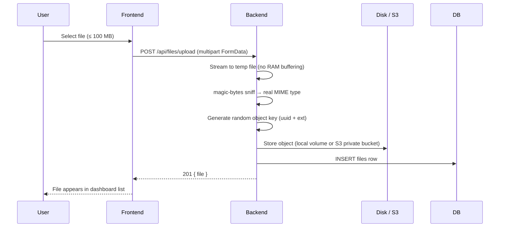
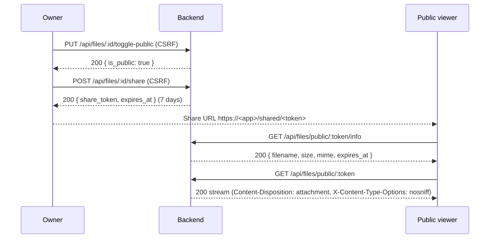
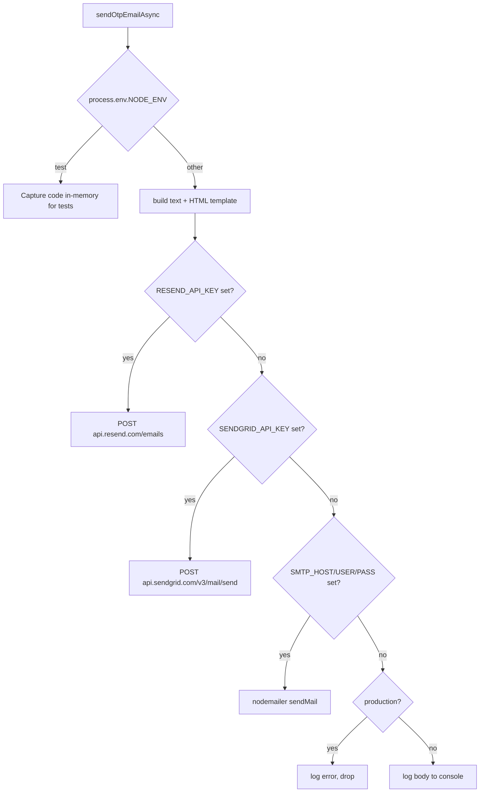
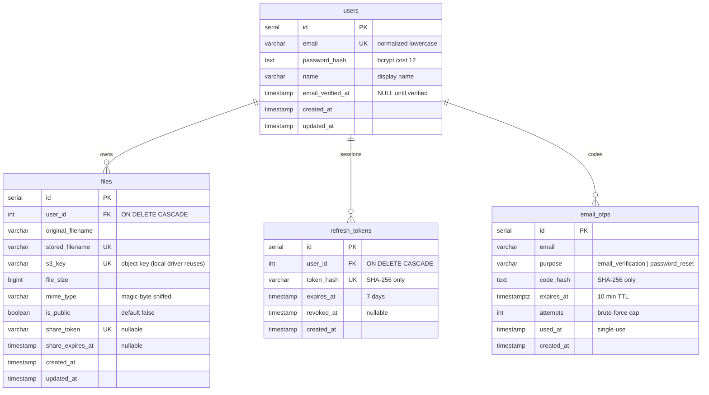
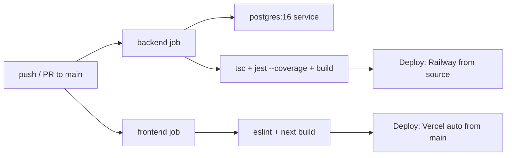

<div align="center">

# Vault — Secure File Storage

A production-grade, full-stack file storage platform with real-email
verification, rotating session security, and pluggable object storage.

**Next.js 16 · Express 4 · TypeScript · PostgreSQL 16 · Local/S3 Storage · SendGrid Email**

[](https://nodejs.org)
[](https://www.typescriptlang.org)
[](https://expressjs.com)
[](https://www.postgresql.org)
[](https://nextjs.org)
[](https://react.dev)
[]()
[]()

</div>

---

## Table of Contents

- [What is it?](#what-is-it)
- [Highlights](#highlights)
- [Tech stack](#tech-stack)
- [Architecture](#architecture)
- [Workflows](#workflows)
  - [Registration & email verification](#1-registration--email-verification)
  - [Login & session lifecycle](#2-login--session-lifecycle)
  - [Password reset](#3-password-reset)
  - [File upload](#4-file-upload)
  - [Public sharing & download](#5-public-sharing--download)
  - [Email delivery pipeline](#6-email-delivery-pipeline)
- [Data model](#data-model)
- [Configuration reference](#configuration-reference)
- [Getting started (local)](#getting-started-local)
- [Running with Docker Compose](#running-with-docker-compose)
- [Production deployment (Railway + Vercel)](#production-deployment-railway--vercel)
- [CI/CD pipeline](#cicd-pipeline)
- [API surface](#api-surface)
- [Security](#security)
- [Testing & quality](#testing--quality)
- [Frontend internals](#frontend-internals)
- [Backend internals](#backend-internals)
- [Troubleshooting & FAQ](#troubleshooting--faq)
- [Roadmap](#roadmap)
- [Project layout](#project-layout)

---

## What is it?

Vault is a **full-stack file storage service**: users sign up with a real email
(verified via a one-time code), upload files, and share them through expiring
public links. It is built to a production bar — defense-in-depth auth, validated
uploads, structured logging, enforced test coverage, and zero known dependency
vulnerabilities.

Two deployable halves share one monorepo:

| Component | Path | Stack |
|---|---|---|
| Backend API | `backend/` | Express 4 + TypeScript + PostgreSQL, Docker image |
| Frontend app | `frontend/` | Next.js 16 (App Router) + React 19 |

---

## Highlights

- **Cookie-based sessions without `localStorage`.** Short-lived JWT access token
  (15 min) + rotating, DB-backed, hashed refresh token (7 days), both in
  `HttpOnly` / `SameSite=Lax` cookies. Double-submit CSRF protection on every
  mutation.
- **Real-email verification.** New accounts must confirm a 6-digit OTP delivered
  via an HTTPS email API — **SendGrid v3** in the current production build (Resend
  and SMTP are supported alternatives) — before they can sign in.
  OTP delivery is **non-blocking** — register/resend/forgot respond in
  milliseconds while mail goes out in the background.
- **Password reset that revokes everything.** Reset OTPs are emailed to the
  verified address; on reset the password is rotated, the account is marked
  verified, and **all existing sessions are revoked**.
- **Uploads that never trust the client.** Files stream through a temp-file
  pipeline, the real type is sniffed from **magic bytes**, and objects are stored
  under random server-generated keys (up to 100 MB without buffering in RAM).
- **Pluggable storage.** Local disk (Railway/Docker volume) or **AWS S3**
  (private ACL, SSE-S3 AES256 or SSE-KMS) behind one driver interface.
- **Shareable, expiring links.** Owners can flip a file to public and mint a
  token with a 7-day expiry; public downloads stream with `attachment` +
  `nosniff`.
- **Operations-ready.** Structured `pino` logging, DB-aware health check,
  per-IP + per-auth rate limiting, helmet security headers, fail-fast env
  validation, graceful shutdown, and CI with enforced coverage gates.

---

## Tech stack

| Layer | Technology | Why |
|---|---|---|
| **Frontend** | Next.js 16 (App Router), React 19, TypeScript 5.9 | RSC + edge-ready SSR, static typing |
| Frontend UI | `motion`, Phosphor Icons, `react-hot-toast` | Animation, iconography, toasts |
| **Backend** | Node 20, Express 4, TypeScript | HTTP API |
| Backend validation | `joi` | Schema validation on every request body |
| Backend auth | `jsonwebtoken`, `bcryptjs` | JWT access tokens, bcrypt password hashing (cost 12) |
| Backend DB | `pg` (node-postgres `Pool`) | Transactional PostgreSQL access |
| Backend uploads | `multer` + `magic-bytes.js` | Streaming multipart + content sniffing |
| Backend storage | `@aws-sdk/client-s3`, `s3-request-presigner` | S3 ops + presigned URLs |
| Backend email | SendGrid v3 REST API (production) + Resend / `nodemailer` fallbacks | OTP / verification / reset delivery |
| Backend logging | `pino`, `pino-http` | Structured + access logs |
| Backend hardening | `helmet`, `cors`, `cookie-parser`, `express-rate-limit` | Headers, CORS, cookies, throttling |
| **Database** | PostgreSQL 16 | Relational store (migrations 001–003) |
| **Storage** | AWS S3 **or** local volume (env-switched driver) | Object storage |
| **Email** | SendGrid HTTPS API, Resend, or SMTP | Reliable transactional delivery |
| **CI** | GitHub Actions | Backend tests vs ephemeral Postgres + frontend lint/build |
| **Deploy** | Vercel (frontend) + Railway (backend & Postgres) | Production hosting |
| **Containers** | Docker (multi-stage, `node:20-alpine`) | Reproducible builds |

---

## Architecture

```
                          ┌────────────────────────────────────────────┐
                          │                   Browser                  │
                          └──────────────────────┬─────────────────────┘
                                                 │  HTTPS
                                                 ▼
        ┌────────────────────────────────────────────────────────────────┐
        │              Vercel — Next.js 16 (frontend)                    │
        │  /api/*  ──rewritten at the platform layer──►  backend         │
        │  (same-origin: no CORS, SameSite=Lax cookies work)             │
        └────────────────────────────────────┬───────────────────────────┘
                                             │  HTTPS /api/* (streams up to 100 MB)
                                             ▼
        ┌────────────────────────────────────────────────────────────────┐
        │            Railway — Express 4 backend (Node 20)               │
        │  auth routes · file routes · otp/email services · storage      │
        └──────────────┬──────────────────────────────┬──────────────────┘
                       ▼                              ▼
        ┌────────────────────────────┐   ┌──────────────────────────────────┐
        │   Railway Postgres (16)    │   │  Storage driver (STORAGE_DRIVER) │
        │   users · files ·          │   │   ├─ local → volume at /data     │
        │   refresh_tokens ·         │   │   └─ s3    → AWS S3 (private,    │
        │   email_otps               │   │              SSE-S3 / SSE-KMS)   │
        └────────────────────────────┘   └──────────────────────────────────┘
```

**Key idea — one origin.** The frontend calls `/api/*` on its own origin and
Next rewrites those to the backend. This makes everything same-origin in
production (no CORS), so `SameSite=Lax` cookie sessions work naturally. On
Vercel the rewrite runs at the **platform layer** (not an edge function), so
uploads up to the 100 MB cap stream end-to-end without the ~4.5 MB
edge-function payload limit.

**Design decisions**

| Decision | Rationale |
|---|---|
| Same-origin `/api` proxy | No CORS, `SameSite=Lax` cookies work, simpler client code |
| Access + refresh token split | Short-lived access token (15 min) limits blast radius; refresh token is rotating and revocable |
| Refresh token hashed in DB | A leaked DB never exposes usable refresh tokens |
| OTP stored hashed + single-use | A leaked DB never exposes codes; replay is impossible |
| Non-blocking email | HTTP responses stay fast; delivery failure is recoverable via resend |
| Server-side magic-byte sniffing | Never trusts `Content-Type` or client filename for security decisions |
| Platform-layer rewrite | Bypasses the 4.5 MB Vercel edge-function body limit for big uploads |

> Full deep-dive — data model, OTP lifecycle, session/CSRF flow, storage
> drivers, and operational history — lives in
> [`docs/ARCHITECTURE.md`](docs/ARCHITECTURE.md).

---

## Workflows

### 1. Registration & email verification



- New accounts are created **unverified** and cannot log in until verified.
- Registering with an existing email returns `409` (no account squatting).
- The OTP is 6 digits from a CSPRNG, stored **only** as a SHA-256 hash,
  single-use, with a 10-minute TTL.
- Delivery is async — the API answers in milliseconds regardless of mail latency.

### 2. Login & session lifecycle



- Tokens live in `HttpOnly` + `Secure` + `SameSite=Lax` cookies — never
  `localStorage`, so XSS can't steal a session.
- The frontend client (`frontend/lib/api.ts`) auto-refreshes on 401 with
  **single-flight** rotation: concurrent 401s share one refresh round-trip.
- Every cookie-authenticated mutation echoes the `csrf_token` cookie back as an
  `X-CSRF-Token` header (double-submit pattern).

### 3. Password reset



- Reset proves email ownership, so the account is also marked verified.
- All sessions (old password, other devices) are invalidated on reset.

### 4. File upload



- The client-sent `Content-Type` and filename are **ignored** for security
  decisions; the real type comes from magic bytes.
- Object keys are random server-generated values — no path traversal, no
  client-chosen keys.

### 5. Public sharing & download



- Share links are unguessable (`share_token` is a random value), public only,
  and expire after `SHARE_LINK_EXPIRY_DAYS` (default 7).
- Public streams are forced to download and can't be sniffed into the page.

### 6. Email delivery pipeline



- **Provider precedence** (per-request): Resend → SendGrid → SMTP → dev console log.
- All HTTP providers use a 15-second timeout and `AbortSignal` so a slow mail
  API can never hang a request thread.
- Production boot **fails fast** if no provider is configured (see
  [Configuration reference](#configuration-reference)); SendGrid additionally
  requires `EMAIL_FROM_EMAIL` to be a verified Single Sender.

---

## Data model

PostgreSQL 16, managed by versioned migrations (`backend/migrations/`). `001`
is core users/files, `002` adds rotating refresh tokens, `003` adds identity +
email verification.



Notes:

- **Sensitive values are never stored raw**: passwords (bcrypt), refresh tokens
  (SHA-256), and OTPs (SHA-256).
- `files.s3_key` doubles as the local driver's filename (a UUID-based random
  value), so the schema is storage-agnostic.
- `email_otps` keeps one active code per `(email, purpose)` — issuing a new code
  invalidates the previous one transactionally.

---

## Configuration reference

All environment variables are validated at boot in `backend/src/config/env.ts`.
Production **fails fast** on missing/invalid values.

| Variable | Default | Required (prod) | Purpose |
|---|---|---|---|
| `JWT_SECRET` | — | ✅ (≥ 32 chars) | Signs access tokens |
| `NODE_ENV` | `development` | — | `production` enables fail-fast validation |
| `PORT` | `5000` | — | HTTP listen port |
| `FRONTEND_URL` | — | ✅ | CORS origin (the Vercel URL) |
| `PUBLIC_FILE_BASE_URL` | — | ✅ | Base for building public share links |
| `DATABASE_URL` | — | if set | Single connection string (overrides `DB_*`) |
| `DB_HOST` / `DB_PORT` / `DB_NAME` / `DB_USER` / `DB_PASSWORD` | localhost / 5432 / … | unless `DATABASE_URL` | Field-by-field DB config |
| `DB_SSL` | `false` | — | `true` for managed providers requiring TLS |
| `DB_SSL_REJECT_UNAUTHORIZED` | `true` | — | Relax TLS cert validation |
| `STORAGE_DRIVER` | `s3` | — | `local` or `s3` |
| `STORAGE_DIR` | `./data` | if `local` | Disk mount for local driver |
| `S3_BUCKET_NAME` | — | if `s3` | S3 bucket |
| `AWS_ACCESS_KEY_ID` / `AWS_SECRET_ACCESS_KEY` / `AWS_REGION` | default chain | — | S3 credentials (IAM role ok) |
| `S3_KMS_KEY_ID` | — | — | Use SSE-KMS instead of SSE-S3 |
| `RESEND_API_KEY` | — | one of 3 providers | Resend HTTPS API |
| `SENDGRID_API_KEY` | — | one of 3 providers | SendGrid v3 REST API |
| `SMTP_HOST` / `SMTP_USER` / `SMTP_PASS` | — | one of 3 providers | SMTP relay (Railway Pro+) |
| `SMTP_PORT` / `SMTP_SECURE` | `587` / `false` | — | SMTP transport options |
| `SMTP_TLS_REJECT_UNAUTHORIZED` | `true` | — | Relax TLS for self-signed relays |
| `EMAIL_FROM_NAME` | `Vault` | — | Display name on outgoing mail |
| `EMAIL_FROM_EMAIL` | — | ✅ if SendGrid | Must be a verified Single Sender |
| `SMTP_FROM_NAME` / `SMTP_FROM_EMAIL` | — | — | Legacy SMTP from-address |
| `OTP_TTL_MINUTES` | `10` | — | OTP validity window |
| `OTP_MAX_ATTEMPTS` | `5` | — | Failed-verification cap (burns code) |
| `OTP_RESEND_COOLDOWN_SECONDS` | `60` | — | Minimum wait between resends |
| `JWT_EXPIRES_IN` | `15m` | — | Access-token lifetime |
| `REFRESH_TOKEN_DAYS` | `7` | — | Refresh-token lifetime |
| `BCRYPT_ROUNDS` | `12` | — | Password hashing cost |
| `MAX_FILE_SIZE` | `104857600` | — | Max upload bytes (100 MB) |
| `SHARE_LINK_EXPIRY_DAYS` | `7` | — | Public share-link TTL |
| `RATE_LIMIT_WINDOW_MS` | `900000` | — | Global rate-limit window |
| `RATE_LIMIT_MAX` | `100` | — | Global per-IP requests/window |
| `AUTH_RATE_LIMIT_MAX` | `20` | — | Login attempts per IP / 15 min |
| `OTP_RATE_LIMIT_MAX` | `30` | — | OTP endpoints per IP / 15 min |
| `LOG_LEVEL` | `info` | — | pino log level |

> Provider precedence: **Resend** if `RESEND_API_KEY` is set, else **SendGrid**
> if `SENDGRID_API_KEY` is set, else **SMTP**. Production currently runs
> SendGrid.

---

## Getting started (local)

Prerequisites: **Node 20+** and a local **PostgreSQL** instance. The built-in
**local storage driver** works with zero AWS setup.

### 1. Database

```bash
psql -U postgres -c "CREATE DATABASE filestorage;"
```

### 2. Backend

```bash
cd backend
cp .env.example .env        # edit DB_* and JWT_SECRET;
                            # STORAGE_DRIVER=local is the default — AWS_* only
                            # needed when STORAGE_DRIVER=s3
npm install
npm run db:migrate          # apply versioned migrations (001→003)
npm run dev                 # or: npm run build && npm start
```

With no email provider configured, OTP bodies are logged to the console
(dev mode) so the flow is usable without a mail server.

### 3. Frontend

```bash
cd frontend
cp .env.example .env.local  # optional; defaults to same-origin proxying
npm install
npm run dev                 # http://localhost:3000
```

---

## Running with Docker Compose

One command brings up the full stack (db + backend + frontend), with migrations
applied automatically on backend start.

```bash
# Local storage — no AWS credentials needed (named volume persists /data).
JWT_SECRET='a-very-long-secure-random-value-32-chars' docker compose up --build

# ...or switch to S3:
JWT_SECRET='a-very-long-secure-random-value-32-chars' STORAGE_DRIVER=s3 \
AWS_ACCESS_KEY_ID='...' AWS_SECRET_ACCESS_KEY='...' \
S3_BUCKET_NAME='your-bucket' docker compose up --build
```

`JWT_SECRET` is interpolated with `:?` so compose fails fast if it's missing.
The frontend's `/api` proxy target is baked in as the `API_BACKEND_URL` build
arg, so `next start` works without runtime env gymnastics.

---

## Production deployment (Railway + Vercel)

The live stack runs **backend + Postgres on Railway** and the **frontend on
Vercel**. `API_BACKEND_URL` is baked into the Next rewrites, keeping the browser
on one origin.

### Current production snapshot (this repo)

| Piece | Live value |
|---|---|
| Frontend | Vercel — `https://filestorage-lovat.vercel.app` (auto-deploys from `main`) |
| Backend API | Railway — `https://backend-production-ce86.up.railway.app` |
| Database | Railway Postgres 16 (managed, internal network) |
| Storage driver | `local` → Railway volume mounted at `/data` |
| Email provider | **SendGrid v3 REST API** (free trial: 100 emails/day, 60 days) |
| Sender | `EMAIL_FROM_EMAIL=9thgradeai@gmail.com` (verified Single Sender) |

### Backend — Railway

```bash
railway init --name filestorage          # add Postgres plugin + backend service
                                         #   (rootDirectory: ./backend)
railway volume add backend-volume        # mount at /data for local storage
```

Service variables:

```
JWT_SECRET=<long random hex ≥32 chars>
NODE_ENV=production
STORAGE_DRIVER=local
STORAGE_DIR=/data
DATABASE_URL=${{Postgres.DATABASE_URL}}
FRONTEND_URL=<frontend https URL>
PUBLIC_FILE_BASE_URL=<frontend https URL>

# Email delivery needs one provider:
#  - SendGrid v3 REST API (current production — free trial, no domain needed,
#    100 emails/day for 60 days; verify a Single Sender, then set its address
#    as EMAIL_FROM_EMAIL)
#  - Resend HTTPS API (recommended alternative — works on all Railway plans,
#    incl. the Free/Trial/Hobby tiers where outbound SMTP is blocked)
#  - SMTP relay (Railway Pro and above only)
SENDGRID_API_KEY=<sg key>
EMAIL_FROM_NAME=Vault
EMAIL_FROM_EMAIL=<verified single sender, e.g. 9thgradeai@gmail.com>
# RESEND_API_KEY=<resend key>            # used when set, over SendGrid
# SMTP_HOST=smtp.example.com   # fallback provider; Pro plan and above
# SMTP_PORT=587
# SMTP_USER=<smtp username>
# SMTP_PASS=<smtp password>
```

Deploy:

```bash
railway redeploy --service backend --environment production --from-source --yes
```

> Changing email provider: unset `RESEND_API_KEY` to make SendGrid the active
> provider, and vice-versa — the service picks one at request time.

> The Dockerfile runs `node dist/db/migrate.js` (idempotent) before starting the
> API, so new schema ships with each deploy.

### Frontend — Vercel

1. `vercel link --project filestorage` (project settings:
   `rootDirectory: frontend`, framework `nextjs`).
2. Set the Production env var `API_BACKEND_URL=https://<backend>.up.railway.app`.
3. `vercel --prod --yes` — or simply push to `main`; GitHub-triggered deploys
   pick up the latest commit.

### End-to-end smoke test (against the live API)

```bash
BASE=https://backend-production-ce86.up.railway.app/api/auth

# 1. Register (409 if account exists)
curl -X POST $BASE/register -H 'Content-Type: application/json' \
  -d '{"name":"Demo","email":"you@example.com","password":"StrongPass123!","confirmPassword":"StrongPass123!"}'

# 2. Resend/trigger an OTP, then verify with the code from your inbox
curl -X POST $BASE/resend-otp -H 'Content-Type: application/json' \
  -d '{"email":"you@example.com","purpose":"email_verification"}'
curl -X POST $BASE/verify-email -H 'Content-Type: application/json' \
  -d '{"email":"you@example.com","otp":"123456"}'

# 3. Login, then hit the authenticated endpoint
curl -c cookies.txt -X POST $BASE/login -H 'Content-Type: application/json' \
  -d '{"email":"you@example.com","password":"StrongPass123!"}'
curl -b cookies.txt $BASE/me
```

---

## CI/CD pipeline

GitHub Actions (`.github/workflows/ci-cd.yml`) runs on every push/PR to `main`:

| Job | Steps | Failure gate |
|---|---|---|
| **backend** | Ephemeral `postgres:16-alpine` service → `npm ci` → `tsc --noEmit` → `npm test -- --coverage` → `npm run build` | Type errors, any failing test, coverage thresholds |
| **frontend** | `npm ci` → `npm run lint` → `npm run build` | Lint errors, build failure |



Deployment is **not** container-push based: Railway builds the backend from
source (`railway redeploy --from-source`), and Vercel auto-deploys the frontend
on every green push to `main`.

---

## API surface

`✓*` = also requires the `X-CSRF-Token` header (echo of the `csrf_token` cookie).

| Method | Path | Auth | Notes |
|---|---|---|---|
| POST | `/api/auth/register` | — | Creates unverified account, emails OTP |
| POST | `/api/auth/verify-email` | — | Verifies emailed OTP, signs in |
| POST | `/api/auth/resend-otp` | — | Resends OTP (60s cooldown) |
| POST | `/api/auth/forgot-password` | — | Emails a reset OTP (enumeration-safe) |
| POST | `/api/auth/reset-password` | — | OTP + new password; revokes sessions |
| POST | `/api/auth/login` | — | Verified accounts only |
| POST | `/api/auth/refresh` | — | Rotates refresh token (cookie) |
| POST | `/api/auth/logout` | ✓* | Revokes refresh token |
| GET | `/api/auth/me` | ✓ | Current user |
| POST | `/api/files/upload` | ✓* | Multipart upload (magic-byte validated) |
| GET | `/api/files?page=&limit=` | ✓ | Paginated list |
| GET | `/api/files/:id` | ✓ | Metadata |
| GET | `/api/files/:id/download` | ✓ | Streams file bytes |
| DELETE | `/api/files/:id` | ✓* | Deletes stored file + metadata |
| PUT | `/api/files/:id/toggle-public` | ✓* | Public/private toggle |
| POST | `/api/files/:id/share` | ✓* | Generates expiring share token |
| GET | `/api/files/public/:token/info` | — | Safe metadata for the shared page |
| GET | `/api/files/public/:token` | — | Streams a public file (attachment) |
| GET | `/api/health` | — | DB-aware readiness check |

Mutating requests authenticate via `Authorization: Bearer` **or** the HttpOnly
access-token cookie. Header-based requests are CSRF-exempt (API clients);
cookie-based browser requests must echo the CSRF cookie as a header.

**Error format.** Non-2xx responses are JSON: `{ "message": string }`, with an
optional `code` (e.g. `EMAIL_NOT_VERIFIED`) for the client to branch on.
Validation errors use Joi's message as `message`.

---

## Security

| Area | Control |
|---|---|
| **Tokens** | JWT (15 min) + rotating, hashed, revocable refresh token (7 days) — never in `localStorage` |
| **Cookies** | `HttpOnly` + `Secure` + `SameSite=Lax` |
| **CSRF** | Double-submit cookie token on all cookie-authenticated mutations |
| **Passwords** | bcrypt (cost 12); weak passwords rejected by policy |
| **Brute force** | Per-IP rate limits (login 20/15 min, OTP 30/15 min) + per-email OTP attempt cap |
| **OTPs** | 6 digits from CSPRNG, stored only as SHA-256, 10-min TTL, single-use, burned after 5 failed attempts |
| **Enumeration** | Uniform forgot-password responses regardless of account existence |
| **Uploads** | 100 MB cap, magic-byte MIME sniffing, server-generated object keys |
| **Serving** | Forced `attachment` + `nosniff` for public streams |
| **Headers** | `helmet` CSP / HSTS / anti-sniffing defaults |
| **Secrets** | Never committed; `JWT_SECRET` ≥ 32 chars enforced at boot |
| **At rest** | S3 private ACL + SSE-S3 (AES256) or SSE-KMS |

---

## Testing & quality

```bash
# Backend (needs a test DB; see backend/jest.config.js defaults)
cd backend
JWT_SECRET=test-secret npm test          # 79 tests, runInBand (avoids DB deadlocks)
JWT_SECRET=test-secret npm run test:coverage

# Frontend
cd frontend
npm run lint
npm run build
```

- **79 backend tests** across auth, files, validation, rate limiting, security,
  and email (Resend, SendGrid, and SMTP providers) — driving the real app against
  a dedicated `filestorage_test` database with a fully mocked S3 client and
  `fetch` (no network calls).
- **Enforced coverage thresholds** — statements ≥ 80%, functions ≥ 75%,
  branches ≥ 50% — currently exceeded across all metrics.
- **CI (GitHub Actions)** spins up an ephemeral `postgres:16` service container
  and runs the full suite on every push/PR to `main`, plus frontend lint/build.
- **`npm audit` clean** — 0 known vulnerabilities in the dependency tree.

---

## Frontend internals

- **Pages** (`frontend/app/`): `page.tsx` (landing), `login`, `register`,
  `forgot-password`, `dashboard`, and `shared/[token]` (public share view).
- **API client** (`frontend/lib/api.ts`): adds the `X-CSRF-Token` header to every
  cookie-authenticated mutation, and implements **single-flight** refresh — when
  any request 401s, one shared `POST /api/auth/refresh` is fired and all
  retried after it resolves.
- **Auth context** (`frontend/lib/auth.tsx`): holds the current user, exposes
  `login/register/verify/logout`, and gates the dashboard on session validity.
- **Same-origin by default**: `API_URL` is empty unless `NEXT_PUBLIC_API_URL`
  is set; `next.config.js` rewrites `/api/*` → `API_BACKEND_URL` at the platform
  layer (keeps uploads streaming beyond the edge-function body limit).
- **Landing page** is a full responsive marketing site (hero, features, how-it
  works, pricing, FAQ, testimonials, API section) built from
  `frontend/components/landing/*`.
- **Accessibility**: skip link, semantic landmarks, ≥44 px touch targets,
  password show/hide toggles, `aria-hidden` on decorative icons, and a
  `min-h-dvh` layout that avoids mobile viewport jumps.

---

## Backend internals

- **Routing** (`src/routes/`): `auth.routes.ts` + `file.routes.ts`, mounted at
  `/api/auth/*` and `/api/files/*`, health at `/api/health`.
- **Controllers** (`src/controllers/`): thin request handlers — validate with
  Joi, delegate to services/models, never talk to Postgres directly with raw SQL
  strings beyond the model layer.
- **Models** (`src/models/`): `user`, `file`, `refreshToken` — parameterized SQL,
  row ↔ object mapping.
- **Services** (`src/services/`):
  - `otp.service.ts` — issue/verify/purge OTPs (CSPRNG, SHA-256, atomic
    consume-with-attempts under `SELECT ... FOR UPDATE`).
  - `email.service.ts` — provider dispatch (Resend → SendGrid → SMTP → dev log),
    branded HTML templates, non-blocking `sendOtpEmailAsync`.
  - `auth.service.ts` — JWT signing, cookie issuance/clearing, refresh rotation.
  - `storage.service.ts` — local-disk and S3 drivers behind one interface.
  - `fileValidation.ts` — magic-byte sniffing, size checks, key generation.
- **Middleware** (`src/middleware/`): `authenticate` (JWT from cookie or
  `Authorization` header), `csrf` (double-submit check), `errorHandler`.
- **Hardening** (`src/index.ts`): helmet, CORS (single frontend origin), JSON
  body + cookie parsing, global/auth/OTP rate limiters, graceful shutdown,
  boot-time `validateEnv()` fail-fast.

---

## Troubleshooting & FAQ

**OTP emails are not arriving.**
1. Check Spam / Promotions. SendGrid's test-domain fallback only delivers to the
   account owner — in production `EMAIL_FROM_EMAIL` must be a **verified Single
   Sender** (Settings → Sender Authentication → Single Sender Verification) and
   must match the address SendGrid has on file.
2. Verify provider precedence in `email.service.ts` — if `RESEND_API_KEY` is
   still set, Resend wins over SendGrid.
3. Confirm the backend boots: `GET /api/health` should return `{"db":"up"}`.

**Backend won't start on Railway.**
The boot-time validation throws if `JWT_SECRET` < 32 chars, no email provider is
configured, or `S3_BUCKET_NAME` is missing while `STORAGE_DRIVER=s3`. Check the
deploy logs — the error message names the missing variable.

**Uploads fail with large files.**
The Vercel rewrite must run at the **platform layer** (not an edge function).
If you switched to an edge rewrite, requests above ~4.5 MB will fail. Keep the
`next.config.js` `rewrites()` config as-is and stay under `MAX_FILE_SIZE`
(100 MB).

**Why can't I use the SMTP provider on Railway?**
Railway blocks outbound SMTP (ports 25/465/587) on Free/Trial/Hobby plans.
Use the Resend or SendGrid HTTPS APIs there; SMTP works on Pro+ or local dev.

**Login says "Please verify your email".**
Accounts created after registration must complete OTP verification first. Use
`resend-otp` to get a fresh code, then `verify-email`.

**How do I switch storage to S3?**
Set `STORAGE_DRIVER=s3`, `S3_BUCKET_NAME`, and credentials (or attach an IAM
role); leave `STORAGE_DIR` unused. Existing local objects won't migrate — this
is a deployment-time choice.

---

## Roadmap

- Object-per-file share URL expiry per link (custom TTLs, revoke before expiry).
- Folder/trash support and multi-select batch operations in the dashboard.
- Presigned S3 GET/PUT uploads to bypass the app server for very large files.
- Webhook/delivery events for share-link views (open tracking).
- Optional 2FA (TOTP) alongside email verification.
- Move backend to a serverless-friendly deployment (same container, new host)
  if the Railway trial credit is exhausted.

---

## Project layout

```
filestorage/
├── backend/                  # Express + TypeScript API
│   ├── migrations/           # versioned SQL: 001_initial, 002_refresh_tokens,
│   │                         #               003_auth_verification
│   ├── src/
│   │   ├── config/           # pg pool, env validation (fail-fast), pino logger
│   │   ├── controllers/      # auth + file request handlers
│   │   ├── middleware/       # authenticate (JWT/cookie), csrf, error handler
│   │   ├── models/           # user, file, refreshToken (SQL access)
│   │   ├── routes/           # auth.routes, file.routes
│   │   ├── services/         # auth (tokens/cookies), otp, email (Resend/
│   │   │                     # SendGrid/SMTP), storage (S3/local), file
│   │   │                     # validation, joi schemas
│   │   ├── db/migrate.ts     # idempotent migration runner
│   │   ├── utils/, types/    # crypto helpers, express typing
│   │   └── __tests__/        # Jest + supertest suites
│   ├── Dockerfile            # multi-stage node:20-alpine; runs migrations at boot
│   └── jest.config.js        # coverage thresholds
├── frontend/                 # Next.js 16 app
│   ├── app/                  # login / register / forgot-password / dashboard /
│   │                         # shared/[token]
│   ├── lib/                  # api client (CSRF + single-flight refresh), auth context
│   ├── components/           # Brand, FileTypeIcon, ProductPreview, landing
│   └── next.config.js        # /api/* rewrites → API_BACKEND_URL
├── .github/workflows/ci-cd.yml   # backend tests/coverage + frontend lint/build
├── docker-compose.yml            # db + backend + frontend (local full stack)
└── docs/ARCHITECTURE.md          # system architecture deep-dive
```